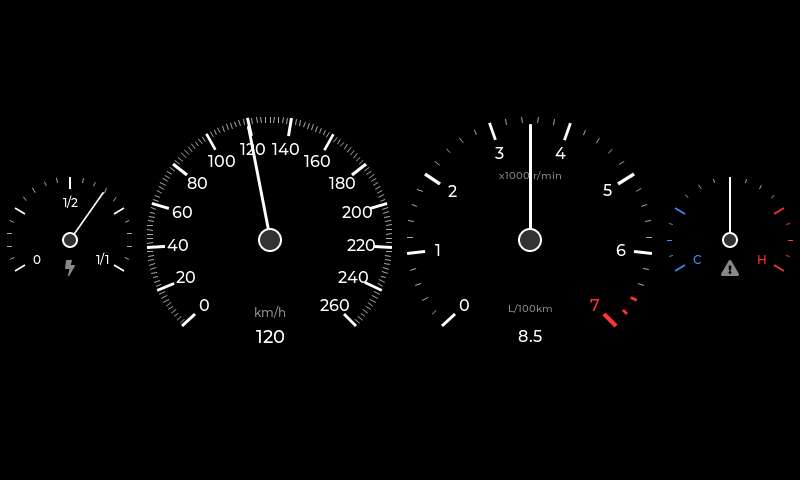
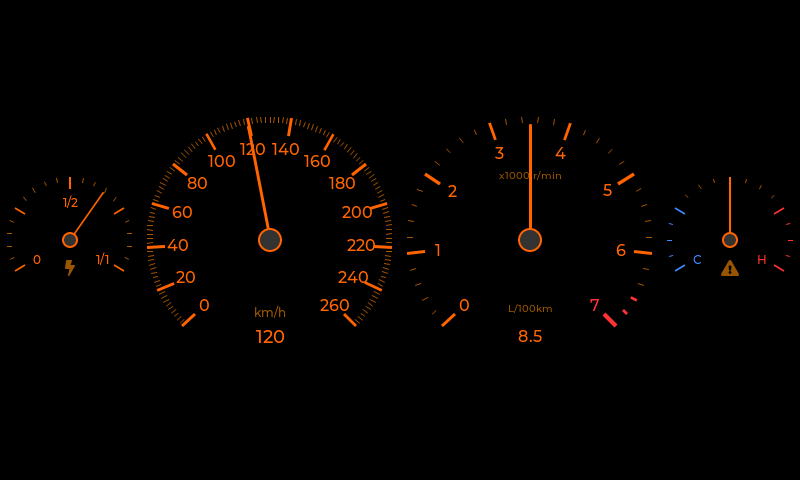
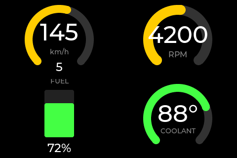
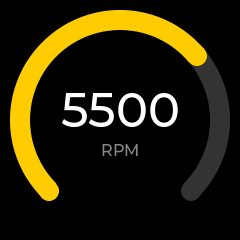
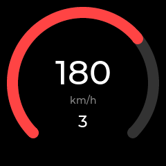

# OpenCluster

Universal, open-source car instrument cluster platform built on ESP32 and LVGL.

Skinnable gauges. Multiple displays. CAN bus native.

---

## What is this?

OpenCluster turns ESP32 microcontrollers into fully customizable instrument cluster
displays. It supports:

- **Skinnable gauges** -- swap between tachometer styles, speedometer designs, and custom
  gauge skins at runtime
- **Multi-gauge layouts** -- display multiple gauges on a single screen using layout
  templates
- **Multi-screen clusters** -- connect multiple ESP32 display nodes via CAN bus to form a
  complete instrument cluster
- **Any display shape** -- round (240x240) and rectangular (480x320+) displays, with
  shape-aware skins
- **Desktop simulator** -- develop and test without hardware using SDL2

## Screenshots

### BMW E46 Instrument Cluster

Day mode and night (backlit) mode:

<p>

</p>
<p>

</p>

### Quad Layout (Generic Gauges)

Four gauges on a single 480x320 display:

<p>

</p>

### Round Gauges (240x240)

Individual gauges sized for round displays:

<p>


</p>

*Generated with `--screenshot` mode. See [Command-line options](#command-line-options-display_node).*

## Architecture

See [ARCHITECTURE.md](docs/ARCHITECTURE.md) for the full system design and
[CLUSTER_BUS_SPEC.md](docs/CLUSTER_BUS_SPEC.md) for the CAN protocol specification.

## Hardware

| Component | POC Target | Notes |
|-----------|-----------|-------|
| MCU | ESP32-S3 | Dual-core 240MHz, PSRAM, TWAI (CAN) |
| Display | Round TFT (GC9A01, 240x240) or rectangular TFT (ILI9341/ST7789, 480x320) | SPI interface |
| CAN transceiver | SN65HVD230 or MCP2551 | One per node |
| Future MCU | ESP32-P4 | GPU, camera input for backup camera |

## Prerequisites

### Desktop (macOS)

```bash
brew install cmake sdl2
```

### Desktop (Ubuntu/Debian)

```bash
sudo apt install cmake libsdl2-dev
```

### ESP32 (when targeting hardware)

Install [ESP-IDF v5.x](https://docs.espressif.com/projects/esp-idf/en/latest/esp32s3/get-started/).

## Building

### Desktop simulator

```bash
cmake -B build -DTARGET=desktop
cmake --build build
```

### ESP32-S3 (requires ESP-IDF)

```bash
idf.py set-target esp32s3
idf.py build
```

## Running the POC

The POC consists of two executables:

1. **can_simulator** -- a headless process that broadcasts fake vehicle data (RPM ramps,
   speed oscillation, etc.) over the simulated CAN bus
2. **display_node** -- an LVGL application that listens for CAN data and renders gauges
   in an SDL2 window

### Quick start

```bash
# Terminal 1: Start the CAN data simulator
./build/can_simulator

# Terminal 2: Display node -- round tachometer
./build/display_node --width 240 --height 240 --skin tachometer

# Terminal 3: Display node -- rectangular speedometer
./build/display_node --width 480 --height 320 --skin speedometer
```

Both display nodes receive the same CAN data via UDP multicast, simulating a multi-screen
cluster where each screen is an independent ESP32.

### Command-line options (display_node)

| Option | Default | Description |
|--------|---------|-------------|
| `--width` | 480 | Display width in pixels |
| `--height` | 320 | Display height in pixels |
| `--skin` | tachometer | Gauge skin name |
| `--layout` | single | Layout template (single, dual_horizontal, dual_vertical, quad, e46_cluster) |
| `--slot0`..`--slot3` | (auto) | Skin for layout slot 0-3 |
| `--node-id` | 1 | Node ID on the cluster bus (1-254) |

#### Screenshot mode

Render a single frame with injected vehicle data and save as BMP, then exit.
Useful for generating documentation images without the CAN simulator.

| Option | Default | Description |
|--------|---------|-------------|
| `--screenshot FILE` | - | Save screenshot as BMP to FILE |
| `--rpm N` | 3500 | Engine RPM |
| `--speed N` | 120 | Speed in km/h |
| `--fuel N` | 65 | Fuel level 0-100% |
| `--coolant N` | 90 | Coolant temperature in °C |
| `--gear N` | 4 | Gear (0=N, 1-8, 255=R) |
| `--backlight N` | 0 | Backlight intensity (0=off, 1-255=on) |
| `--consumption N` | 85 | Fuel consumption in L/100km * 10 |

Example:
```bash
./build/display_node --screenshot e46.bmp \
    --layout e46_cluster --width 800 --height 480 \
    --rpm 4500 --speed 140 --backlight 200
```

## Project Structure

```
opencluster/
├── CMakeLists.txt              # Top-level build
├── components/
│   └── lvgl/                   # LVGL 9.x (submodule, includes SDL2 driver)
├── hal/                        # Hardware abstraction layer
│   ├── include/                # HAL interface headers
│   ├── desktop/                # SDL2 + UDP + POSIX implementations
│   └── esp32s3/                # LCD + TWAI + FreeRTOS implementations
├── core/                       # Platform-independent logic
│   ├── vehicle_data.*          # Shared data model
│   ├── skin.*                  # Skin interface + registry
│   ├── layout.*                # Layout template system
│   ├── commands.*              # Cluster command handling
│   └── can_protocol.h          # CAN message encode/decode
├── skins/                      # Gauge skin implementations
│   ├── tachometer/
│   ├── speedometer/
│   ├── fuel_gauge/
│   ├── coolant_temp/
│   └── e46/                    # BMW E46-style needle gauges
├── screenshots/                # Auto-generated via --screenshot mode
├── apps/
│   ├── display_node/           # Main display application
│   └── can_simulator/          # CAN data broadcaster
└── docs/
    ├── CLUSTER_BUS_SPEC.md     # CAN protocol specification
    └── AGENTS.md               # AI agent definitions
```

## Adding a Skin

1. Create a new directory under `skins/`, e.g. `skins/boost_gauge/`
2. Implement the `gauge_skin_t` interface:

```c
#include "skin.h"

static void *boost_create(lv_obj_t *parent, int w, int h) {
    // Build LVGL widget tree, return context
}

static void boost_update(void *ctx, const vehicle_data_t *data) {
    // Update widgets from vehicle data
}

static void boost_destroy(void *ctx) {
    // Clean up
}

const gauge_skin_t skin_boost = {
    .name         = "boost_gauge",
    .display_name = "Turbo Boost",
    .create       = boost_create,
    .update       = boost_update,
    .destroy      = boost_destroy,
};
```

3. Register it in the skin registry (called at startup)
4. Use it: `./build/display_node --skin boost_gauge`

## License

TBD

## Status

**POC / Pre-alpha.** Not ready for production use. The architecture is being validated
on desktop before moving to real hardware.
