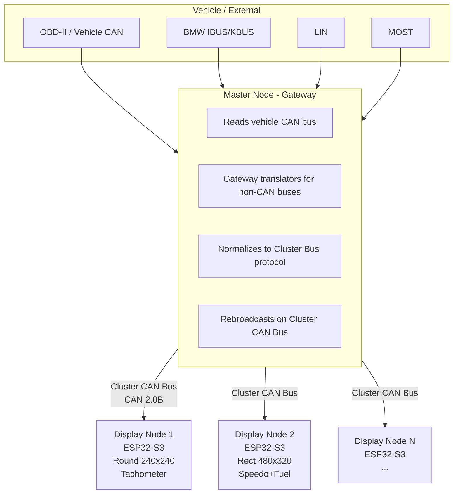
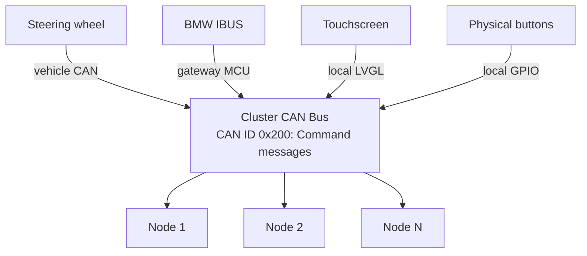
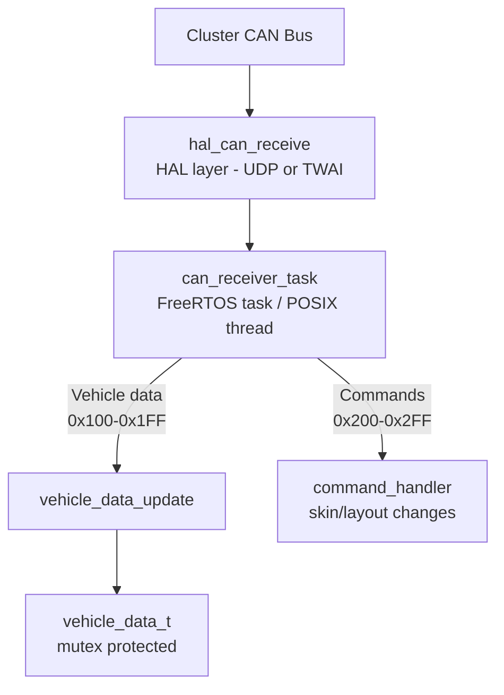
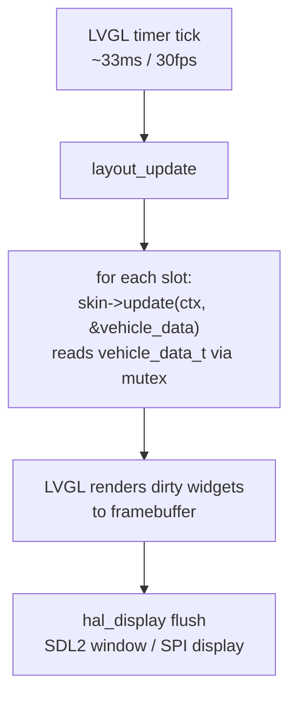
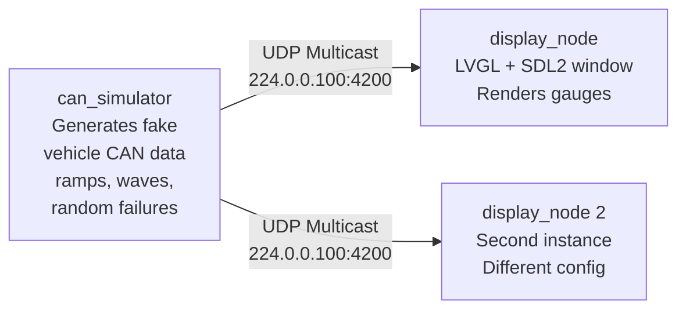

# OpenCluster Architecture

## Overview

OpenCluster is a universal car instrument cluster platform built on ESP32 hardware and LVGL.
It supports skinnable gauges, multiple display form factors, and multi-screen clusters
communicating over a CAN bus.

The architecture is designed around three principles:

1. **Hardware abstraction** -- the same gauge/skin code runs on desktop (SDL2) and ESP32
2. **Composability** -- multiple gauges on one screen, or multiple screens forming one cluster
3. **CAN as the universal bus** -- all data and commands flow through CAN (real or simulated)

---

## System Architecture



### Node Roles

| Role | Description |
|------|-------------|
| **Master Node** | Reads vehicle bus, normalizes data, broadcasts on cluster bus. One per cluster. May be a dedicated gateway MCU or a display node with dual CAN. |
| **Display Node** | Listens to cluster bus, renders gauges via LVGL. Each node has its own display, skin config, and layout. |

---

## Hardware Targets

| Target | Status | Notes |
|--------|--------|-------|
| **Desktop (SDL2)** | Primary for POC | macOS/Linux. LVGL renders to SDL2 window. CAN simulated via UDP multicast. |
| **ESP32-S3** | Primary HW target | Dual-core 240MHz, PSRAM, TWAI (CAN 2.0B). SPI or parallel display. |
| **ESP32-P4** | Future | Built-in GPU/PPA, camera interface (backup camera). |

---

## HAL (Hardware Abstraction Layer)

All platform-specific code lives behind HAL interfaces. The core application, skins, and
layout system never touch hardware directly.

### HAL Interfaces

#### `hal_display.h` -- Display initialization and LVGL driver registration

```c
// Initialize the display hardware and register LVGL display driver.
// Returns the LVGL display object.
lv_display_t *hal_display_init(int width, int height);
```

- **Desktop**: SDL2 window + LVGL SDL driver
- **ESP32-S3**: SPI/parallel TFT + LVGL ESP LCD driver

#### `hal_can.h` -- CAN bus send/receive

```c
typedef struct {
    uint32_t id;        // CAN ID (11-bit standard)
    uint8_t  len;       // Data length (0-8)
    uint8_t  data[8];   // Payload
} can_frame_t;

int  hal_can_init(void);
int  hal_can_send(const can_frame_t *frame);
int  hal_can_receive(can_frame_t *frame, uint32_t timeout_ms);
void hal_can_deinit(void);
```

- **Desktop**: UDP multicast (224.0.0.100:4200). CAN frames serialized as-is.
- **ESP32-S3**: TWAI peripheral (CAN 2.0B, 500kbps default)

#### `hal_platform.h` -- OS primitives

```c
uint32_t hal_tick_ms(void);
void     hal_delay_ms(uint32_t ms);
void    *hal_mutex_create(void);
void     hal_mutex_lock(void *mutex);
void     hal_mutex_unlock(void *mutex);
```

- **Desktop**: POSIX (`clock_gettime`, `usleep`, `pthread_mutex`)
- **ESP32**: FreeRTOS (`xTaskGetTickCount`, `vTaskDelay`, `xSemaphoreCreateMutex`)

#### `hal_input.h` -- Local input devices

```c
// Initialize local input devices (touch, buttons, encoder).
// Registers them with LVGL's input device system.
void hal_input_init(lv_display_t *display);
```

- **Desktop**: SDL2 mouse + keyboard mapped to LVGL
- **ESP32-S3**: Touch controller (I2C) + GPIO buttons/encoder

---

## Core Components

### Vehicle Data Model (`core/vehicle_data.h`)

A single `vehicle_data_t` struct is the source of truth for all gauge values on a node.

```c
typedef struct {
    // Engine -- CAN ID 0x100
    uint16_t rpm;              // 0-16000
    uint8_t  throttle_pct;     // 0-100
    int8_t   coolant_temp_c;   // -40 to 215
    uint8_t  oil_pressure_psi; // 0-255

    // Drivetrain -- CAN ID 0x101
    uint16_t speed_kmh_x10;    // 0-3000 (speed * 10 for 0.1 resolution)
    uint8_t  gear;             // 0=N, 1-8=forward, 255=R
    uint32_t odometer_km;      // total km (lower 24 bits in CAN)

    // Fuel / Electrical -- CAN ID 0x102
    uint8_t  fuel_level_pct;   // 0-100
    uint16_t battery_mv;       // millivolts (0-20000)
    uint16_t warning_flags;    // bitmask (see spec)

    // Metadata
    uint32_t last_update_ms;   // timestamp of last CAN update
} vehicle_data_t;
```

- Updated by the CAN receiver task
- Read by the LVGL render task each frame (~30 fps)
- Protected by a mutex (via `hal_platform.h`)

### Skin Interface (`core/skin.h`)

A skin is a self-contained gauge renderer. It knows how to create LVGL widgets, update
them from vehicle data, and tear them down.

```c
typedef struct {
    const char *name;           // unique identifier, e.g. "tachometer_arc"
    const char *display_name;   // human-readable, e.g. "Arc Tachometer"

    // Lifecycle
    void *(*create)(lv_obj_t *parent, int width, int height);
    void  (*update)(void *ctx, const vehicle_data_t *data);
    void  (*destroy)(void *ctx);
} gauge_skin_t;
```

- `create` -- builds LVGL widget tree inside `parent`, returns opaque context pointer
- `update` -- called each frame with current vehicle data, animates widgets
- `destroy` -- tears down widgets, frees context
- Skins register themselves at startup via `skin_registry_register(&skin_tachometer)`

### Layout Templates (`core/layout.h`)

A layout defines how multiple gauge slots are arranged on a screen.

```c
typedef struct {
    int x, y, w, h;  // slot position and size (relative to screen, 0-1000 permille)
} layout_slot_t;

typedef struct {
    const char    *name;        // e.g. "single", "dual_horizontal"
    int            slot_count;
    layout_slot_t  slots[4];    // max 4 gauges per screen for now
} layout_template_t;
```

Templates use permille (0-1000) coordinates so they scale to any resolution.
The layout engine translates these to actual pixel positions at render time.

Predefined templates:

| Template | Slots | Description |
|----------|-------|-------------|
| `single` | 1 | Full-screen single gauge |
| `dual_horizontal` | 2 | Side-by-side (rectangular displays) |
| `dual_vertical` | 2 | Top-bottom stack |
| `quad` | 4 | 2x2 grid |

### Cluster Commands (`core/commands.h`)

High-level commands that flow between nodes on the cluster bus.

```c
typedef enum {
    CMD_SKIN_NEXT        = 0x01,
    CMD_SKIN_PREV        = 0x02,
    CMD_SKIN_SET         = 0x03,  // param: skin index
    CMD_LAYOUT_NEXT      = 0x10,
    CMD_LAYOUT_SET       = 0x11,  // param: layout index
    CMD_NIGHT_MODE       = 0x20,  // param: 0=off, 1=on
    CMD_BRIGHTNESS       = 0x21,  // param: 0-255
    CMD_WARNING_ACK      = 0x30,
    CMD_NODE_IDENTIFY    = 0xF0,  // param: node_id (for discovery)
} cluster_command_t;
```

---

## Input Architecture

All input eventually becomes either a local LVGL event or a cluster bus command (or both).



### Input Rules

1. **Local-first processing**: touchscreen taps and button presses are handled by LVGL
   immediately (zero latency). The resulting semantic command is *then* broadcast on the
   cluster bus so other nodes can react.

2. **Command messages, not raw events**: the cluster bus carries high-level commands
   (`CMD_SKIN_NEXT`, `CMD_WARNING_ACK`) not raw input coordinates. Each node translates
   its local input into commands before broadcasting.

3. **External bus translation**: non-CAN buses (IBUS, KBUS, LIN, MOST) are translated to
   CAN by a gateway before reaching the cluster bus. The cluster bus only speaks CAN.

4. **Deduplication**: commands include a `source_node_id` field. The originating node
   ignores its own broadcast to avoid double-processing.

---

## Data Flow

### CAN Receiver Path (display node)



### Render Path



---

## Desktop Simulation

### Two-Process Architecture

The POC runs as two (or more) separate OS processes on the desktop:



- `can_simulator` broadcasts CAN frames via UDP multicast
- Each `display_node` instance opens its own SDL2 window and listens for CAN data
- Multiple `display_node` instances simulate a multi-screen cluster
- Command-line args control skin, layout, display size per instance

### Running Locally

```bash
# Build
cmake -B build -DTARGET=desktop
cmake --build build

# Terminal 1: start CAN simulator
./build/can_simulator

# Terminal 2: display node (round tachometer)
./build/display_node --width 240 --height 240 --skin tachometer

# Terminal 3: display node (rectangular speedo + fuel)
./build/display_node --width 480 --height 320 --layout dual_horizontal \
    --slot0 speedometer --slot1 fuel_gauge
```

---

## Project Structure

```
opencluster/
├── CMakeLists.txt                  # Top-level build (desktop vs ESP-IDF)
├── components/
│   └── lvgl/                       # LVGL 9.x (git submodule, includes SDL2 driver)
├── hal/
│   ├── include/
│   │   ├── hal_display.h
│   │   ├── hal_can.h
│   │   ├── hal_input.h
│   │   └── hal_platform.h
│   ├── desktop/                    # SDL2, UDP multicast, POSIX
│   │   ├── hal_display_sdl.c
│   │   ├── hal_can_udp.c
│   │   ├── hal_input_sdl.c
│   │   └── hal_platform_posix.c
│   └── esp32s3/                    # SPI/RGB LCD, TWAI, FreeRTOS
│       ├── hal_display_esp.c
│       ├── hal_can_twai.c
│       ├── hal_input_esp.c
│       └── hal_platform_freertos.c
├── core/
│   ├── vehicle_data.h / .c         # Shared data model + mutex accessors
│   ├── skin.h                      # Skin interface definition
│   ├── skin_registry.h / .c        # Register and look up skins
│   ├── layout.h / .c               # Layout template system
│   ├── commands.h / .c             # Cluster command definitions + handler
│   └── can_protocol.h              # CAN ID assignments + frame encode/decode
├── skins/
│   ├── tachometer/
│   │   └── skin_tachometer.c       # Arc-based RPM gauge
│   └── speedometer/
│       └── skin_speedometer.c      # Speed gauge (different style)
├── apps/
│   ├── display_node/
│   │   └── main.c                  # Main display application
│   └── can_simulator/
│       └── main.c                  # Fake CAN data broadcaster
└── docs/
    ├── ARCHITECTURE.md             # This file
    ├── CLUSTER_BUS_SPEC.md         # CAN message specification
    └── AGENTS.md                   # AI agent definitions for development
```

---

## Future Considerations

- **ESP32-P4 target**: GPU/PPA acceleration, camera input for backup camera overlay
- **JSON/scripted skins**: load skin definitions from filesystem instead of compiled C
- **OTA updates**: firmware + skin updates over WiFi
- **DBC file support**: parse standard DBC files for vehicle-specific CAN decoding on master node
- **SquareLine Studio integration**: design skins visually, export to LVGL code
